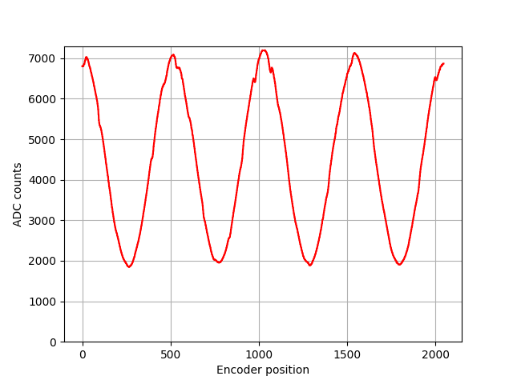

#   FPGA polarimeter
## Encoder Sampling
This is a simple FPGA project, that will sample data from an ADC, store it in internal memory and then print it through a Serial port. Even though it was used to test the functionality of the ADC and quadrature encoder RTL.
<p align="middle">
    
</p>

## Running the project

Code can be uploaded to the Arty S7-25 board through vitis. The board will send data over Serial with baud rate of 230400. Switch SW0 should in the ON position, or the motor will not start running (if it was in OFF position, just switch it to ON and reset the board). If the switch is in the correct position the LD2 should light up. 
LEDs LD2 to LD5 are used to signal the state of the board.
|LED|ON state| OFF State |
| --- | --- | --- |
| LD2 | SW0 is ON, motor can run | SW0 if OFF, motor is in standby |
| LD3 | Motor is spinning in correct direction | Motor is spinning in the wrong direction |
| LD4 | Data is ready | Data is has not been / is being sampled |
| LD5 | Device is idle | Data is being sampled | 

If the motor is spinning and LD3 is OFF, the motor should be reversed. This can be done by swapping wires or, by writting to BLDC motor controller over I2c. This could be simply implemented in code, but I don't know whether it is worth the effort, as it is very easy to swap wires.

If everything is ok the motor should be spinning and LD2, LD3 and LD5 should be ON while LD4 should be off and these 4 lines should appear on Serial terminal:
```
I: Initializing!
I: Motor Started!
I: Configuring Interrupts!
I: Configured Interrupts!
```
If you now press BTN0, the LD5 should turn OFF and quickly after that both LD5 and LD4 should turn ON. A lot of data should appear on the Serial terminal formatted as:
```
[Address]:[Data]
```
[Data] simply tells us the ADC count that was sampled at the encoder count equal to [Address].


You can also use the provided [Python](/Encoder_sampling/Software/sampling.py) code, which will display two plots, showing the sampled data like:
<p align="middle">
  
   
</p>
The plots show data acquired from a polarimeter which is looking at linearly polarized light.
We can compare this to an oscilloscope capture. Yellow trace is encoder I signal - HIGH when the motor crosses the 0 point. Green trace is the analog voltage measured on the PDAPC-1 diode.
<p align="middle">
    
</p>
We can see that the oscilloscope signal is much noisier, which is probably a consequence of the fact that the signal is sampled when digital lines are being switched. In case of the sampler core, the acquisition happens only when both the SPI for ADC and encoder outputs are static. 

## Possible uses/Ideas
This FPGA project is simply a relatively flexible sampling core. The encoder can be replaced by some sort of a counting core to generate the position data, from which the possibilities are endless. For example this could be used in a [balancing machine](https://en.wikipedia.org/wiki/Balancing_machine). I have also left the option to connect a second ADC to the sampling core for this exact purpose.

## How it works
The FPGA part is relatively straight forward. There are three custom modules:
* The encoder module consisting of [Encoder_decoder.v](/Encoder_sampling/Vivado/Encoder_sampler.srcs/sources_1/new/Encoder_decoder.v) along with 3 [Input_debouncer.v](/Encoder_sampling/Vivado/Encoder_sampler.srcs/sources_1/new/Input_debouncer.v). Debouncers are used because quadrature encoders can produce slightly noisy outputs. Together these allow us to know absolute angle of the motor. The debounced A and B signal from the encoder is also used to trigger the ADC acquisition.
* The [AD7983_driver.v](/Encoder_sampling/Vivado/Encoder_sampler.srcs/sources_1/new/AD7983_driver.v) allows the FPGA to talk to the [EVAL-AD7983-PMDZ](https://www.analog.com/en/design-center/evaluation-hardware-and-software/evaluation-boards-kits/eval-ad7983-pmdz.html) board connected to the JA pmod connector. When the core receives a trigger input it will start the ADC acquisition. When acquisition is complete the 16bits of data will be output.
* The [sampling_controller.v](/Encoder_sampling/Vivado/Encoder_sampler.srcs/sources_1/new/sampling_controller.v) takes the encoder count and the generated ADC data and and stores the data to on-chip memory (BRAM). The data is only sampled after the core receives a trigger input, which is generated by pressing the BTN0 on the board. There is also a data ready signal which is output when all 2048 readings have been taken, used to generate an interrupt.