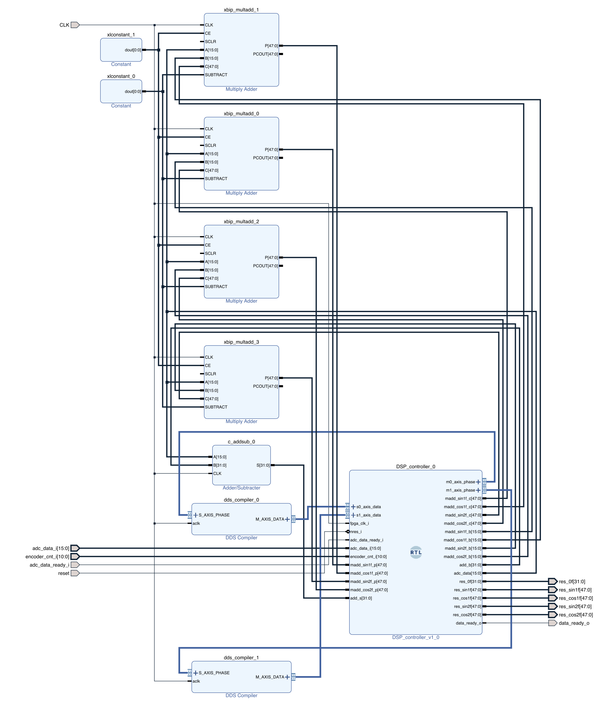

# FPGA Polarimeter
This is a continuation of [Encoder_sampling](../Encoder_sampling/), where the data buffer was replaced by a DSP core that internally processes the signals. This also means, that no hardware changes have to be made.
<p align="middle">
    
</p>

## Running the project
Simmilarly, the code can be built and uploaded through Vitis. Please refer to [Encoder_sampling](../Encoder_sampling/) for setting up the motor. If everything is correct LD2 and LD3 should light up, and the motor should be spinning.

The board can be accessed through Serial with 230400 baud rate, no parity and one stop bit. On startup following lines should appear:
```
I: Initializing!
I: Motor Started!
I: Configuring Interrupts!
```
After these, lines of data should start comming in. Data is formatted as:
```
[A];[B];[C];[D];[E]
```
Where:
* [A] is an unsigned value corresponding to DC component in diode signal
* [B] is a signed value of sin(2f) in diode signal
* [C] is a signed value of cos(2f) in diode signal
* [D] is a signed value of sin(4f) in diode signal
* [E] is a signed value of cos(4f) in diode signal

The data can be read using [graphing.py](/Polarimeter_core/Software/graphing.py). The program will read the incoming data and calculate the [Stokes parameters](https://en.wikipedia.org/wiki/Stokes_parameters). Both data from FPGA as well as calculated Stokes parameters are displayed as time plots. There is also an additional Poincare sphere plot as well as polarization ellipse plot. Current version only supports "calibration" using a reference horizontally polarized light
<p align="middle">
  
</p>
<p align="middle">
   
</p>

## How it works
Instead of storing the ADC readings into BRAM like with the [Encoder_sampling](../Encoder_sampling/), were processing the signal. To understand everything it is important to know a little bit of background.

### Measured signal
To calculate the intensity of the light detected by the photodiode, we can use [Mueller calculus](https://en.wikipedia.org/wiki/Mueller_calculus). The angle of QWP can be expressed as $\omega t +\delta $. Where $\omega$ is the ANGULAR frequency ($\omega = 2\pi f$, $f$ is frequency) and $\delta$ is the zero position of the QWP (angle at which the encoder sits). There is also the angle $\theta$ of the linear polarizer inside the polarimeter. Intensity $I'$ of the light transmitted through the QWP and polarizer can now be written as:
$$ \begin{aligned}I=&S_0 + \frac{1}{2}\left[S_1\cos(2\theta)+ S_2\sin(2\theta)\right]\\ 
+ &\sin(2\omega t)[S_3\cos(2\delta - 2\theta)]+\\
+ &\cos(2\omega t)[S_3\sin(2\delta - 2\theta)]+\\
+ &\sin(4\omega t)\left[\frac{\cos4\delta}{2}\left[S_1\sin(2\theta) + S_2\cos(2\theta)\right] - \frac{\sin4\delta}{2}\left[S_1\cos(2\theta) - S_2\sin(2\theta)\right]\right]+\\
+ &\cos(4\omega t)\left[\frac{\sin4\delta}{2}\left[S_1\sin(2\theta) + S_2\cos(2\theta)\right] + \frac{\cos4\delta}{2}\left[S_1\cos(2\theta) - S_2\sin(2\theta)\right]\right]. \end{aligned}$$
Where $S_0$, $S_1$, $S_2$ and $S_3$ are stokes parameters of the measured light. Here we can see that the signal will be composed of a DC component along with 4 AC components with double and quadruple frequency of rotation. These can be obtained by "mixing" the signal with a reference signal and integrating it over time. Since we're processing the signals digitally, we can obtain $A$, $B$, $C$, $D$, $E$ components as:
$$\begin{aligned}A&=\frac{1}{N}\sum_{i=0}^{N-1}I_i,\\ 
B&=\frac{1}{N}\sum_{i=0}^{N-1}I_i\sin(2\frac{2\pi}{N}i),\\
C&=\frac{1}{N}\sum_{i=0}^{N-1}I_i\cos(2\frac{2\pi}{N}i),\\
D&=\frac{1}{N}\sum_{i=0}^{N-1}I_i\sin(4\frac{2\pi}{N}i),\\
E&=\frac{1}{N}\sum_{i=0}^{N-1}I_i\cos(4\frac{2\pi}{N}i).\\
\end{aligned}$$
Here we have used $N$ to denote the total number of samples and $I_k$ is the $k$-th sample of intensity.

 

### FPGA implementation

As we can see, we'll need a reference signal at double and quadruple frequency for both values of $\sin()$ and $\cos()$. This can be implemented using two Xilinx DDS compiler IP in SIN/COS LUT mode. Since the output of the encoder is 11 bits wide, we need a 10 and 9 bit wide phase input on the LUTs. Output width is set to 16 bits for symmetry as well as the fact that there are no repeated values of the sin/cos data.
To multiply and add the values together 4 Multiply Adder IPs are used along with a single Adder/Substracter IP.


ADC readings, SIN/COS Lut outputs, multiply adders require a module which will move data between inputs and outputs at correct times. [DSP_controller.v](/Polarimeter_core/Vivado/Polarimeter_Microblaze.srcs/sources_1/new/DSP_controller.v) does just that. When the QWP is in correct position it writes the phase data to both SIN/COS LUTs. When ADC data is ready along with data from LUTs it writes that data to multiply adders such that it gets multiplied. It also writes previous results such that they get added. In case of the DC component it just simply adds it to the previous sum. When a full circle is completed the data is written to output registers and the internal registers get reset back to 0.

Data is read by MicroBlaze from a modified [AXI-Lite slave](https://zipcpu.com/blog/2020/03/08/easyaxil.html) register.
