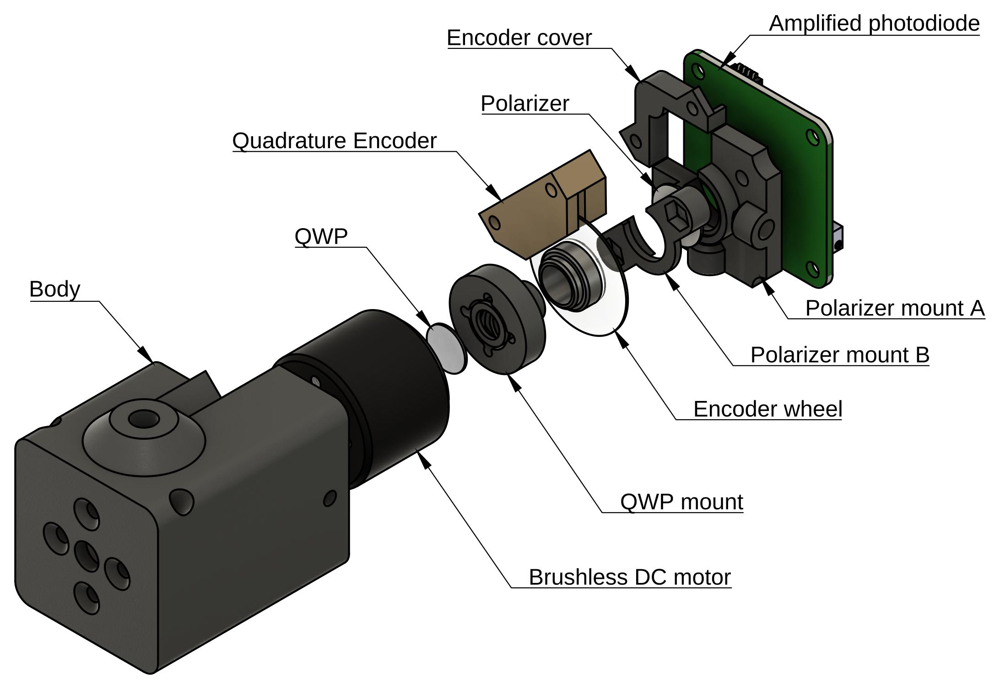
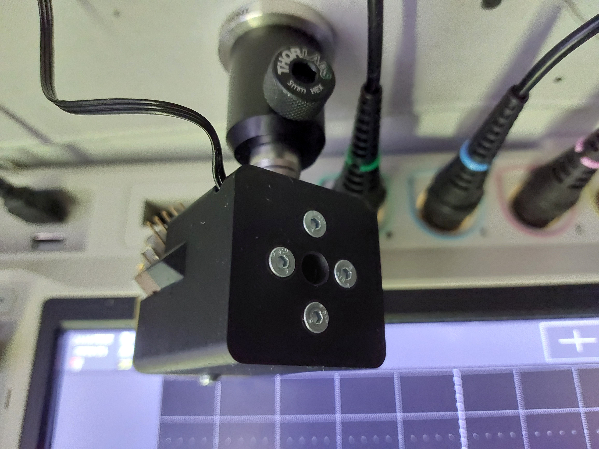
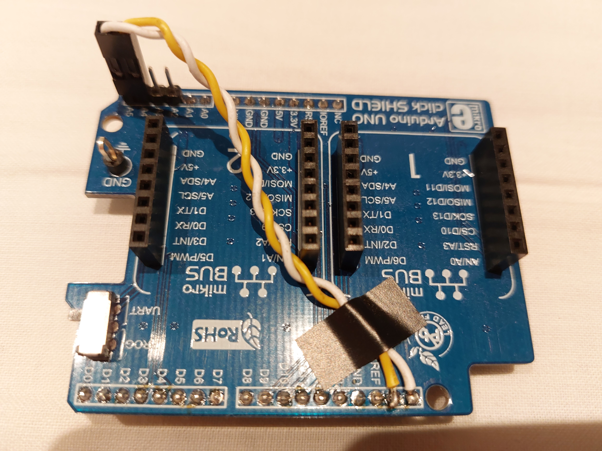

# FPGA Polarimeter
A project trying to use an FPGA as the brain of a polarimeter.
## A few notes
* This project was started for the purpose of [7 Ways to Leave Your Spartan-6](https://community.element14.com/technologies/fpga-group/w/documents/27537/7-ways-to-leave-your-spartan-6-fpga?ICID=fpga-feature-widget) community program run by AMD-Xilinx and element14. 
* All of the components were provided by both STM lab and [Cold atom lab](https://ultracool.ijs.si/) of Josef Stefan Institute. 
* Further work will be done in regards of this projects as it will be used as a core of my master's thesis. Therefore, if you wish to make your own FPGA polarimeter I would suggest waiting for a bit since many things could change.

This project is split into two parts:
* [Encoder_sampling](/Encoder_sampling/) simply makes 2048 readings which are output through Serial. The output data is simply unmodified ADC readings. This part by itself could be used to create a polarimeter, but relatively large ammount of data transfered between the FPGA and PC would lower the maximum update rate of the device.
* [Polarimeter_core](/Polarimeter_core) uses internal DSP to find the 5 required frequency components, to determine the polarization parameters. These are then output through Serial. 
## Hardware
The device consists of two modules, the electronics and the physical "sensor". In the middle of the electronics is the Digilent Arty S7-25. The FPGA is connected to an ADC aswell as a brushless DC motor controller. ADC is communicating via SPI, while the motor controller communicates through I2C.
### Sensor

The sensor is a relatively complex part for its size. Before reading any further, I would suggest a quick glance at a commercialy available [polarimeter](https://www.thorlabs.com/newgrouppage9.cfm?objectgroup_id=1564) (under the Operation tab, is a nice description of how these devices work).

Simmilarly the sensor consists of a motor, which spins the quarter wave plate (QWP). Attached to the motor is also a 3 channel [Quadrature encoder](https://en.wikipedia.org/wiki/Incremental_encoder) which allows us to know the angle of the QWP. Behind the motor sits a linear polarizer, behind which sits a photodiode. The construction is fully printable using an FDM 3D priner. When assembled the sensor fits inside a 40x40x60mm box.

Both .step file of the whole assembly can be found [here](/Hardware). The 3d printed parts are located [here](/Hardware/3D_printed_parts/). I have used both [Prusament PLA](https://www.prusa3d.com/product/prusament-pla-galaxy-silver-1kg/) and [Plastika Trček PLA](https://plastikatrcek.si/izdelek/pla-filament/). I used 0.1mm layer height with 15% infill. The hardest part to print is the QWP mount as it has an embedded spring in the middle. To assemble everything I have used threaded inserts from [Ruthex](https://www.ruthex.de/) except for the holes used to mount the Quadrature encoder, which were tapped.

## Bill of materials
### Electronics
| Description | Used part |
| ----  | ---- | 
|FPGA   | [Arty S7 - 25](https://digilent.com/reference/programmable-logic/arty-s7/start)|
|ADC    | [EVAL-AD7983-PMDZ](https://www.analog.com/en/design-center/evaluation-hardware-and-software/evaluation-boards-kits/eval-ad7983-pmdz.html)|
|Motor controller | [Brushless 7 click](https://www.mikroe.com/brushless-7-click)|
|Shield adapter | [Arduino UNO click shield](https://www.mikroe.com/arduino-uno-click-shield)

NOTE: The shield adapter should be modified such that the Arty S7 and the shield adapter do NOT connect on pins A2-A5. A5 on the shield adapter should be connected to the header that connects to SCL on the Arty S7. Simmilarly A4 on the adapter should be connected to SDA on the Arty.

### Sensor
|Description | Used part |
|---|---|
|QWP|[Ø10mm zero order quarter wave plate](https://www.toweroptical.com/product/zero-order-wave-plate-10mm/) |
|Linear polarizer|[Ø1/2" linear film polarizer](https://www.thorlabs.com/thorproduct.cfm?partnumber=LPNIRE050-B)|
|Quadrature Encoder|[HEDB-9140-I13](https://www.broadcom.com/products/motion-control-encoders/incremental-encoders/incremental-encoders-code-wheels/hedb-9140-i13)|
|Brushless DC motor|[GB2208](https://store.tmotor.com/goods.php?id=447) |
|Amplified photodiode| [PDAPC-1](https://www.thorlabs.com/thorproduct.cfm?partnumber=PDAPC1)|

## Electrical connections

### ADC
The EVAL-AD7983-PMDZ board is a standard PMOD peripheral. For this project it is connected to JA header on the Arty. VIN+ SMB connector is connected to the MMCX coax connector on the PDAPC-1. VIN- is not connected to anything. ADC has to be supplied with +7.5V as well as -2.5V. [This](https://wiki.analog.com/resources/eval/user-guides/circuits-from-the-lab/pulsar-adc-pmods) can be used as a guide on how the module should be used. 
### Brushless 7 click
The Brushless 7 click module is plugged in miniBus slot 2 on the shield adapter which is plugged into arduino header on the Arty. Power supply input is connected to 12V used to supply the diode amplifier. The U, V and W are connected to the Brushless DC motor in the Sensor assembly.

### Encoder
The Quadrature encoder is connected to the Arty on the JC header as follows:
|Quadrature encoder pin|Pin function|Arty S7 JC pin number|
|---|---|---|
|1| GND | 5 |
|2| Out I| 1|
|3| Out A| 2|
|4| VCC | 6|
|5| Out B| 3|

If the cable is relatively long a capacitor should be connected to the power inputs on the encoder. This can be easily done on the 2 metal brackets of the encoder. Pin numbering of the encoder can be found [here](https://docs.broadcom.com/docs/AV02-1132EN).

### Amplified photodiode
The output of the diode is both on the 2x5 pin header as well as the MCX connector on the side of the board. I have used the MCX as it was a bit simpler. The header 2x5 is connected to a +12V, GND and -12V only. In future I might connect the gain inputs, which would allow me to have some sort of automatic gain control.

## References
For this project these sources were used:
* [Verilog code for ADC converter](https://wiki.analog.com/resources/fpga/altera/bemicro/ad7983)
* [Verilog code for quadrature encoder](https://www.fpga4fun.com/QuadratureDecoder.html)
* [Verilog code for debouncer](https://www.fpga4fun.com/Debouncer2.html)
* [C code for communication with Brushless 7 click](https://github.com/MikroElektronika/Brushless_7_click)

